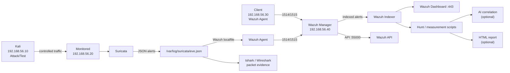
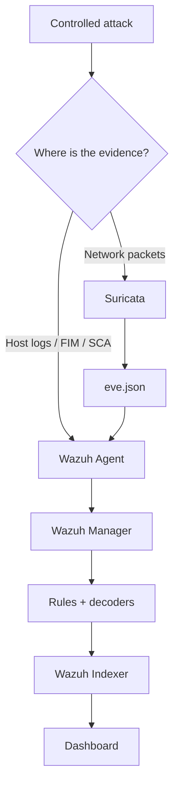
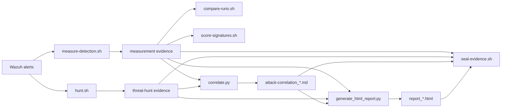

# NISec System Architecture

## 1. Purpose

NISec is a small, reproducible security-monitoring laboratory built around two complementary
detection layers:

- **Suricata** observes network traffic and generates network IDS events.
- **Wazuh** collects endpoint telemetry, applies host-based rules, stores alerts, and presents
  them centrally.

The design intentionally separates **detection**, **storage/presentation**, and **analysis**.
Optional AI components consume existing evidence; they do not replace the sensors or alter raw
alerts.

---

## 2. Logical architecture



### Important interpretation

The architecture has two independent evidence paths:

1. **Network path:** packet → Suricata → `eve.json` → Wazuh Agent → Manager.
2. **Host path:** authentication/FIM/SCA telemetry → Wazuh Agent → Manager.

Both paths converge at the Wazuh Manager and are then stored/indexed and displayed centrally.
This is why a host rule can still detect an attack when a network threshold is deliberately
evaded.

---

## 3. Deployment topology

```text
192.168.56.0/24 — private host-only network
┌───────────────────────────────────────────────────────────────────────────────┐
│                                                                               │
│  ATTACK / TEST                  MONITORING                  MANAGEMENT        │
│  ┌─────────────────┐            ┌───────────────────┐      ┌───────────────┐ │
│  │ kali .10        │            │ monitored .20     │      │ wazuh .40     │ │
│  │                 │            │                   │      │               │ │
│  │ nmap            │──attack──>│ Suricata           │      │ Manager       │ │
│  │ hydra           │            │ Wazuh Agent        │─────>│ Indexer       │ │
│  │ hping3          │            │ FIM / SCA          │1514  │ Dashboard     │ │
│  │ nikto           │            │ tshark             │1515  │ API           │ │
│  └─────────────────┘            └───────────────────┘      └───────────────┘ │
│                                         ▲                         ▲            │
│                                         │                         │            │
│                                  ┌──────┴──────┐                  │            │
│                                  │ client .30  │──────────────────┘            │
│                                  │ Wazuh Agent │                               │
│                                  └─────────────┘                               │
│                                                                               │
└───────────────────────────────────────────────────────────────────────────────┘
```

| VM | IP | Zone | CPUs | RAM | Main services |
|---|---|---|---:|---:|---|
| `wazuh-server` | `192.168.56.40` | Management | 2 | 6144 MB | Manager, Indexer, Dashboard |
| `monitored` | `192.168.56.20` | Monitoring | 2 | 2048 MB | Suricata, Agent, FIM, tshark |
| `client` | `192.168.56.30` | Client | 1 | 1536 MB | Agent, FIM |
| `kali` | `192.168.56.10` | Attack/Test | 2 | 2048 MB | attack tooling |

These values are defined in `Vagrantfile`.

---

## 4. Security-zone model and boundary

The project uses four logical zones:

| Zone | Purpose | Main trust assumption |
|---|---|---|
| Management | central security infrastructure | administrative access only |
| Monitoring | network and endpoint sensor | receives test traffic; forwards telemetry |
| Client | ordinary monitored endpoint | sends endpoint telemetry |
| Attack/Test | controlled adversarial activity | untrusted within the lab |

### Deliberate limitation

All four VMs use the same host-only `/24`. Therefore this is **not equivalent to four
production VLANs**. Isolation is primarily achieved through:

- private host-only networking,
- service exposure,
- Wazuh authentication,
- firewall rules applied by the hardening script,
- keeping the lab disconnected from external networks for attack traffic.

A production architecture should use separate VLANs/subnets and an enforcing firewall between
trust zones.

---

## 5. Component responsibilities

### Wazuh Manager

The Manager is the central analysis point. It receives agent telemetry, decodes events,
evaluates rules, and creates Wazuh alerts.

Relevant source configuration:

```text
config/wazuh-manager/local_rules.xml
config/wazuh-manager/local_decoder.xml
```

### Wazuh Indexer

The Indexer provides persistent searchable storage for Wazuh alert data. It is part of the
server stack even though the coursework proposal primarily names the Wazuh Manager.

### Wazuh Dashboard

The Dashboard is the human-facing interface for alerts, agents, SCA findings, and other
Wazuh data. It is exposed on TCP 443 in the lab.

### Wazuh Agent

Agents on `monitored` and `client` collect endpoint data. On `monitored`, the Agent also
collects Suricata's JSON event stream.

### Suricata

Suricata is the network IDS. Its custom local rules are:

| SID | Purpose |
|---:|---|
| `9000001` | ICMP flood threshold |
| `9000002` | TCP SYN scan threshold |
| `9000003` | repeated SSH connection threshold |

The source rules live in `config/suricata/local.rules`.

### Packet capture

`tshark` captures raw packets for corroboration and debugging. A capture can answer a
different question from an IDS alert: whether the traffic actually reached the sensor and
what the packet-level behaviour looked like.

---

## 6. Suricata → Wazuh integration

This is the core integration path:

```text
Kali traffic
    │
    ▼
Suricata
    │
    ├── signature / threshold match
    │
    ▼
/var/log/suricata/eve.json
    │
    │ Wazuh Agent localfile JSON reader
    ▼
Wazuh Manager
    │
    ├── JSON decoding
    ├── built-in rules
    └── local_rules.xml
          ├── 100101+ Suricata severity rules
          ├── 100120 custom-SID rule
          └── 100200–100202 FIM/malware rules
    │
    ▼
Wazuh Indexer
    │
    ▼
Dashboard
```

The Agent integration is configured through `config/wazuh-agent/ossec.conf.snippet`.

The manager's custom rules should be treated as a **translation/enrichment layer**:
Suricata decides that a network signature fired; Wazuh assigns the event to the central
alerting model and makes it searchable beside host alerts.

---

## 7. End-to-end alert lifecycle

1. **Generate** — Kali launches a controlled test.
2. **Observe** — Suricata sees network packets; Wazuh sees endpoint logs/FIM events.
3. **Persist raw evidence** — Suricata writes `eve.json`; endpoint logs remain on the host.
4. **Collect** — Wazuh Agent forwards telemetry to the Manager.
5. **Decode and classify** — Manager decoders and rules produce Wazuh alerts.
6. **Store** — Indexer stores alert documents for search and dashboard views.
7. **Present** — Dashboard exposes the event to the analyst.
8. **Measure** — scripts record detection rate and timing.
9. **Corroborate** — packet captures or source logs can validate the event.
10. **Analyse** — hunt/correlation/report tooling converts the evidence into higher-level
    findings.
11. **Respond (optional)** — active response can be enabled to block an attacking IP.

The first seven stages form the normal monitoring pipeline. Stages 8–11 are evidence and
response layers around that pipeline.

---

## 8. Detection architecture



The split is intentional:

- Network signatures are useful for reconnaissance, floods, and protocol-level indicators.
- Host rules are useful for authentication failures and endpoint state changes.
- FIM detects file-system changes that a passive network sensor may not understand.
- SCA checks configuration posture rather than individual network packets.

---

## 9. Analysis architecture

Analysis begins **after** the detection pipeline:



### AI boundary

`correlate.py` and `generate_html_report.py` are intentionally downstream of Wazuh.

AI does **not**:

- inspect raw network traffic directly,
- replace Suricata signatures,
- replace Wazuh rules,
- modify `alerts.json`,
- execute commands,
- trigger active response,
- generate the report's numerical measurements.

The correlation pipeline first performs deterministic grouping and deduplication. Only
eligible uncached multi-event groups may reach Gemini. The HTML report builds tables/charts
deterministically and uses AI only for narrative text.

---

## 10. Data stores and evidence

| Data / artefact | Location | Role |
|---|---|---|
| Suricata JSON | `/var/log/suricata/eve.json` | raw network IDS events |
| Wazuh alerts | `/var/ossec/logs/alerts/alerts.json` | central alert evidence |
| Wazuh service log | `/var/ossec/logs/ossec.log` | troubleshooting |
| Suricata compiled rules | `/var/lib/suricata/rules/suricata.rules` | loaded IDS rules |
| Packet captures | `evidence/pcaps/` | raw packet corroboration |
| Attack logs | `evidence/logs/` | test execution evidence |
| Measurement reports | `evidence/detection-results_*.md` | quantitative detection results |
| Hunt reports | `evidence/threat-hunt_*.md` | analyst-style findings |
| Correlation reports | `evidence/attack-correlation_*.md` | structured attack-chain analysis |
| HTML reports | `evidence/report_*.html` | combined presentation |
| AI cache | `evidence/ai-cache/` | repeat-call avoidance |
| Integrity manifest | `evidence/` | SHA-256 evidence integrity check |

---

## 11. Network ports

| Port | Direction / use | Exposure |
|---:|---|---|
| `22/tcp` | SSH administration | Vagrant forwarded host ports |
| `1514/tcp` | Wazuh Agent → Manager | lab network |
| `1515/tcp` | Wazuh agent enrolment | lab network |
| `443/tcp` | Dashboard HTTPS | management access |
| `55000/tcp` | Wazuh API | management access |
| `9200/tcp` | Indexer | not intended for external exposure |

Exact firewall behaviour is implemented by `scripts/harden-dashboard.sh`; do not infer
production-grade segmentation from these ports alone.

---

## 12. Deployment variants

### Native installer

```text
Ubuntu VM
 ├── wazuh-manager (systemd)
 ├── wazuh-indexer (systemd)
 └── wazuh-dashboard (systemd)
```

This is the default Vagrant deployment.

### Docker

```text
Ubuntu VM
 └── Docker Compose
      ├── Wazuh Manager
      ├── Wazuh Indexer
      └── Wazuh Dashboard
```

The alternative deployment is under `deploy-docker/`. Endpoint agents remain native on the
monitored/client VMs.

---

## 13. Security controls

| Control | Type | Implementation |
|---|---|---|
| Network IDS | Detective | Suricata + ET/local rules |
| Host monitoring | Detective | Wazuh Agent + Manager rules |
| File integrity | Detective | Wazuh FIM |
| Configuration assessment | Detective | Wazuh SCA |
| Dashboard access control | Preventive | UFW + Wazuh authentication/hardening |
| Log retention | Preventive/administrative | `configure-retention.sh` |
| Active blocking | Response | `active-response.xml.snippet`, opt-in |
| Evidence integrity | Assurance | `seal-evidence.sh` |

A key architectural distinction is that **detective controls do not automatically prevent the
attack**. Active response and access-control hardening are separate controls.

---

## 14. Failure boundaries

When a detection is missing, troubleshoot the chain in this order:

```text
Did the attack generate traffic/event?
        ↓
Did Suricata / Wazuh source record it?
        ↓
Did the Agent collect it?
        ↓
Did Manager decode it?
        ↓
Did a rule match?
        ↓
Was it indexed?
        ↓
Is Dashboard querying the correct data?
```

`make test` helps isolate **signature matching** from **live pipeline delivery**. Packet
captures help isolate **traffic visibility** from **signature logic**.

---

## 15. Design limitations

This architecture is intentionally a teaching/lab system.

1. One host-only subnet is not production segmentation.
2. Suricata is used primarily as IDS, not inline IPS.
3. Threshold rules are rate-dependent and therefore can be evaded by slowing traffic.
4. Source-based thresholds can be weakened by distributed/decoy sources.
5. Passive IDS visibility is limited for encrypted application payloads.
6. Four VMs are not representative of enterprise scale.
7. AI analysis is optional and depends on the quality and completeness of upstream alerts.
8. The evidence manifest provides tamper-evidence for the captured set, but a co-located
   manifest is not equivalent to an independent trusted evidence repository.

These limitations are part of the system's documented evaluation boundary.
